

  

# Skills Workbench

Skills Workbench is a curated library of reusable agent skills for engineering, delivery, content, design, documentation, and automation work.

## What This Repository Contains

The repository packages skills as portable folders with:

- `SKILL.md` instructions and trigger metadata
- optional `scripts/` helpers
- optional `references/` documents
- optional `assets/` such as icons or templates

The main `skills/` tree contains active packaged skills. The `future-consideration/` tree holds ideas and drafts that are not yet packaged for active use.

## Local-Only Workspace Convention

Use `local-docs/` at the repo root for machine-local notes, handoffs, continuity artifacts, or other working documents that should stay beside the work without being committed.

The repository `.gitignore` should include `local-docs/`. Skills that deal with repository bootstrap or local continuity should preserve tracked defaults such as `docs/handoff/`, but they can route explicitly local-only artifacts into `local-docs/` when that better matches the user's intent.

## Active Skill Families

### Engineering

Location: [skills/engineering](./skills/engineering)

-  [repo-setup](./skills/engineering/repo-setup) (RST): bootstrap a repository with licensing, governance docs, draft-release scaffolding, a WIP GitHub description, and PR-based protection on `main`.
- 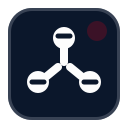 [engineering-workflow-orchestrator](./skills/engineering/engineering-workflow-orchestrator) (EWO): coordinate the engineering skill flow, keep workflow stage explicit, and optionally shape hook-aware continuity including transcript backup, manifest-driven restart, and handoff/pickup routing.
-  [doc-driven-development](./skills/engineering/doc-driven-development) (DDD): turn epic or end-state product truth into feature contracts, implementation-planning notes, work packages, and acceptance artifacts before coding.
-  [repo-dissection](./skills/engineering/repo-dissection) (RDS): dissect inherited or unclear repositories and turn assumptions into verified documented understanding.
-  [query-to-knowledge](./skills/engineering/query-to-knowledge) (QTK): resolve open repo questions into durable knowledge and canonical documentation.
-  [repo-knowledge-engineering](./skills/engineering/repo-knowledge-engineering) (RKE): establish and maintain the repository knowledge framework, canonical product truth, reading order, plans, decisions, glossary, tracker alignment, and validation evidence.
-  [repo-publish-finaliser](./skills/engineering/repo-publish-finaliser) (RPF): finalise a repository for public release, including publish-safety scanning, release-automation decisions, and final description cleanup.
-  [local-handoff](./skills/engineering/local-handoff) (LHO): write a dated local handoff so the next session can resume safely, with compact standard mode and a richer max-verbosity mode for higher-risk continuity.
-  [local-pickup](./skills/engineering/local-pickup) (LPK): resume from a local handoff or continuity artifacts and rebuild trustworthy context before editing.
-  [tracker-publisher](./skills/engineering/tracker-publisher) (TPU): publish stable work packages into GitHub, Linear, or a local task surface without redesigning the hierarchy.
-  [test-plan-writer](./skills/engineering/test-plan-writer) (TPW): turn requirements and change notes into proportionate QA plans and test cases.

### Automation

Location: [skills/automation](./skills/automation)

- 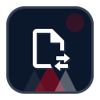 [pandoc-converter](./skills/automation/pandoc-converter) (PDC): run Pandoc conversions with predictable defaults while still allowing custom flags.
-  [tasklist-gantt-creator](./skills/automation/tasklist-gantt-creator) (TGC): generate stakeholder-ready Excel Gantt charts from task lists or planning exports.

### Content

Location: [skills/content](./skills/content)

- 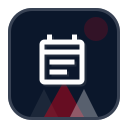 [agenda-generator](./skills/content/agenda-generator) (AGN): draft lean or formal meeting agendas from simple prompts or richer context.
-  [linkedin-short-post-drafter](./skills/content/linkedin-short-post-drafter) (LSP): write short LinkedIn-style posts for updates, launches, events, and capability highlights.
-  [long-form-post-drafter](./skills/content/long-form-post-drafter) (LFP): build evidence-grounded long-form posts, launch articles, and blog-style content.
-  [meeting-pack-processor](./skills/content/meeting-pack-processor) (MPP): turn notes or transcripts into internal packs, follow-up emails, and justified routing outputs.
-  [release-note-writer](./skills/content/release-note-writer) (RNW): turn shipped change detail into concise, customer-facing release notes.
-  [scheduling-assistant](./skills/content/scheduling-assistant) (SCH): turn meeting requests into calendar-aware slot proposals and ready-to-send emails.

### Delivery

Location: [skills/delivery](./skills/delivery)

-  [ai-initiative-builder](./skills/delivery/ai-initiative-builder) (AIB): guide early AI initiative discovery, shaping, and prioritisation.
-  [ai-initiative-deep-dive-and-scoping](./skills/delivery/ai-initiative-deep-dive-and-scoping) (ADS): pressure-test and scope AI initiatives that are ready for deeper validation.
- 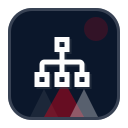 [clickup-project-plan-builder](./skills/delivery/clickup-project-plan-builder) (CPP): turn project briefs into practical ClickUp structures, hierarchy, tags, and views.
-  [feedback-rice-prioritiser](./skills/delivery/feedback-rice-prioritiser) (FRP): convert messy feedback into clean product problem statements and RICE drafts.
- 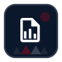 [implementation-plan-writer](./skills/delivery/implementation-plan-writer) (IPW): produce customer-facing implementation plans from kickoff material and confirmed assumptions.
- 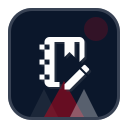 [kickoff-summary-writer](./skills/delivery/kickoff-summary-writer) (KSW): turn kickoff and discovery material into evidence-backed summaries for the right audience.
-  [project-context-builder](./skills/delivery/project-context-builder) (PCB): create or refresh a canonical `PROJECT.md` from scattered project context.
-  [project-packager](./skills/delivery/project-packager) (PKG): turn an existing `PROJECT.md` into audience-specific or system-ready project outputs.
-  [project-report-writer](./skills/delivery/project-report-writer) (PRW): build project reports from fresh delivery signals, structured execution data, and durable context.
-  [project-support](./skills/delivery/project-support) (PRS): orient and validate real project work before a more specialized project skill takes over.
-  [training-plan-writer](./skills/delivery/training-plan-writer) (TRW): create paired customer-facing and facilitator-grade training plans from agreed scope.

### Design

Location: [skills/design](./skills/design)

- 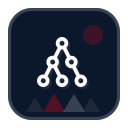 [mermaid-flowchart-designer](./skills/design/mermaid-flowchart-designer) (MFD): turn rough notes or existing Mermaid code into clearer flowcharts and architecture diagrams.
- 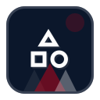 [source-derived-design-system-builder](./skills/design/source-derived-design-system-builder) (SDS): turn real visual references into a reusable design skill and persistent `DESIGN.md`.

### Documentation

Location: [skills/documentation](./skills/documentation)

- 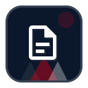 [docx-assistant](./skills/documentation/docx-assistant) (DXA): create, revise, review, validate, and return `.docx` documents in this environment.
-  [knowledge-transfer-documentation-writer](./skills/documentation/knowledge-transfer-documentation-writer) (KTD): write concise internal knowledge transfer docs from authoritative source material.
-  [process-document-writer](./skills/documentation/process-document-writer) (PDW): create or revise formal process docs, SOPs, runbooks, and operating procedures.

### Media

Location: [skills/media](./skills/media)

-  [elevenlabs-ai-voice-gen](./skills/media/elevenlabs-ai-voice-gen) (EAV): write and clean narration scripts for ElevenLabs voice generation.
-  [remotion-explainer-video-production](./skills/media/remotion-explainer-video-production) (REV): create Remotion explainer-video plans, timing layouts, overlays, and branded composition guidance.

### Meta

Location: [skills/meta](./skills/meta)

-  [skill-eval-suite-writer](./skills/meta/skill-eval-suite-writer) (SEW): build evaluation suites, scenario matrices, and grader strategies for skills.
- 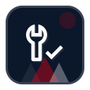 [llm-instruction-fixer](./skills/meta/llm-instruction-fixer) (LIF): repair prompts, skills, and other LLM instruction artifacts from a review or fix brief.
-  [llm-instruction-reviewer](./skills/meta/llm-instruction-reviewer) (LIR): inspect prompts and instruction artifacts for execution risks before publication or repair.
- 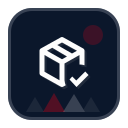 [skill-finaliser](./skills/meta/skill-finaliser) (SKF): turn draft or imported skills into clean, publishable skill packages.
-  [setup-polaralias-skills](./skills/meta/setup-polaralias-skills) (SPS): create update-safe shared Polaralias defaults under `~/.agents/config/polaralias-skills` with `~/.config` as fallback, including shared tracker, structured-output, and continuity preferences.

## Using The Repository

- browse the packaged skills under [skills](./skills)
- use [INDEX.md](INDEX.md) if you need the canonical packaged-skill path list
- keep future or not-yet-packaged ideas under [future-consideration](./future-consideration)

## Versioning

This repository uses a repo-level [VERSION](./VERSION) file for GitHub Releases.

- adding, deleting, or renaming a packaged skill is a repo-major bump
- changing more than one packaged skill in one release is at least a repo-minor bump
- changing exactly one packaged skill is usually a repo-patch bump unless that skill’s own semver bump is larger

## Contributing

For repository workflow, packaging rules, and agent-focused maintenance context, read [AGENTS.md](AGENTS.md).
